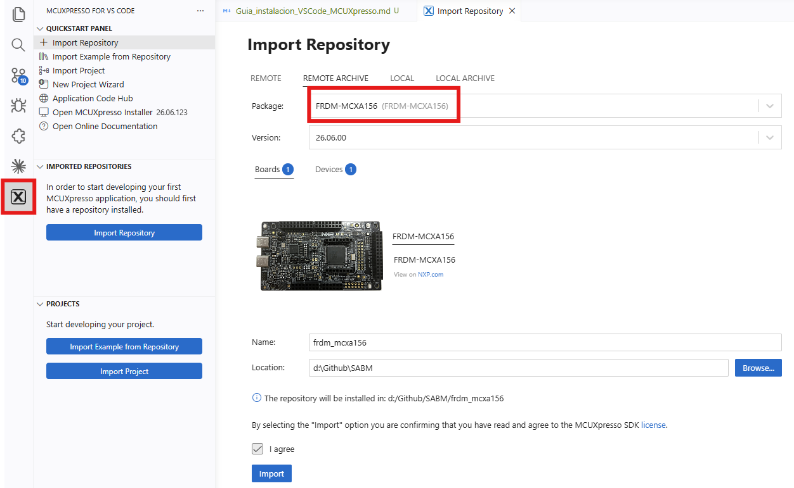
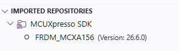
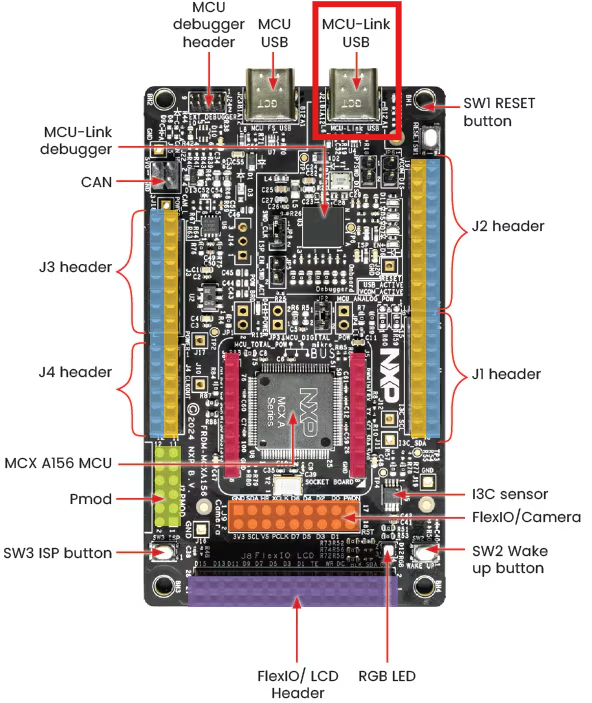
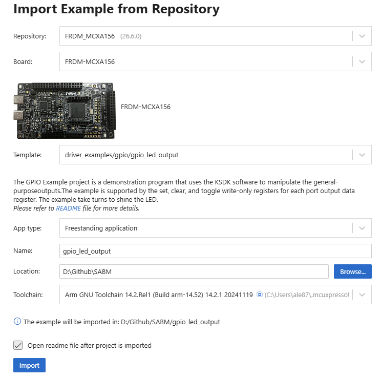
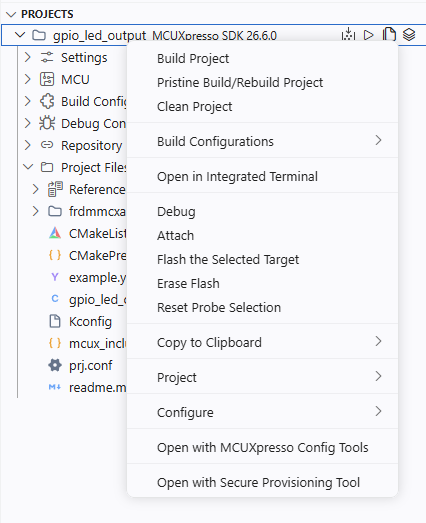
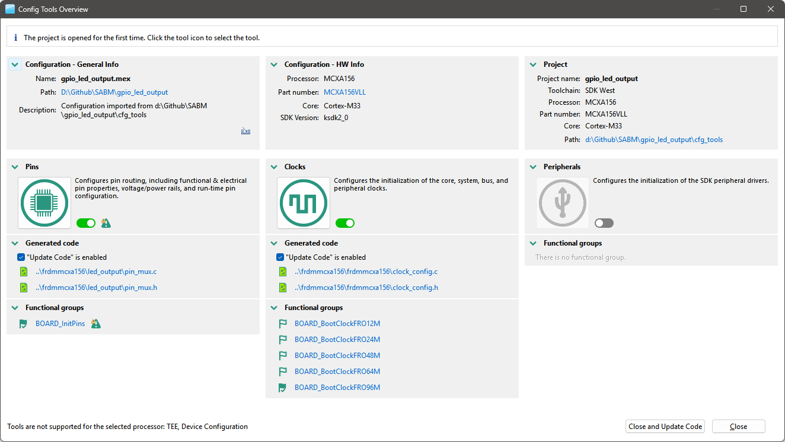
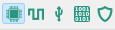
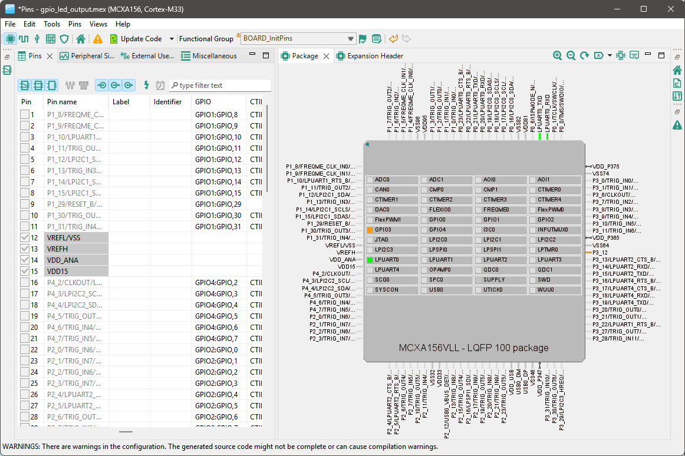
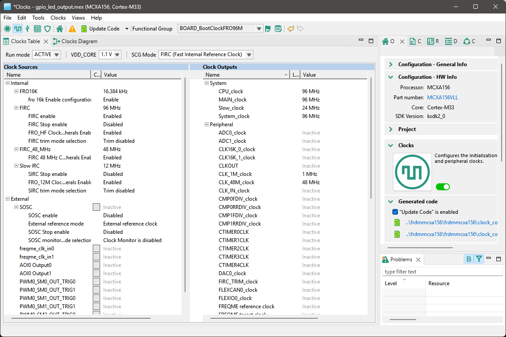
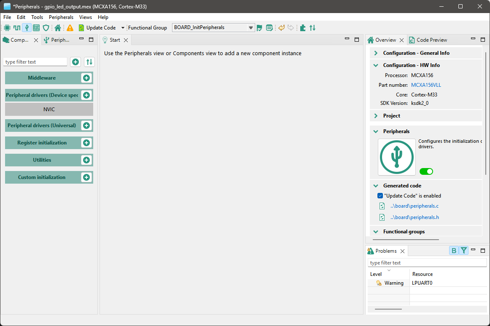

# Guía de instalación del entorno de desarrollo — SABEM

## 1. Objetivo

Al terminar esta guía tendréis, en vuestro propio portátil o en el PC del laboratorio:

1. Visual Studio Code con la extensión **MCUXpresso for VS Code** instalada.
2. El SDK de la tarjeta **FRDM-MCXA156** importado.
3. Un **proyecto de prueba** (parpadeo del LED de la tarjeta) importado, compilado, cargado y
   ejecutándose sobre vuestra tarjeta real.
4. La certeza de que la cadena completa —editor, compilador, sonda de depuración, tarjeta— funciona,
   antes de que dependáis de ella para nada del AGV.

No hace falta ningún montaje: la FRDM-MCXA156 se alimenta y se depura por el mismo cable USB-C.

## 2. Lo que necesitáis antes de empezar

| Elemento | Nota |
| --- | --- |
| Un PC con Windows, macOS o Linux | El del laboratorio ya lo tiene todo instalado; en vuestro portátil, seguid esta guía completa |
| La tarjeta **FRDM-MCXA156** | Con su cable USB tipo C |
| Conexión a Internet | Para descargar VS Code, la extensión y el SDK (~cientos de MB) |
| Una carpeta de trabajo **sin espacios ni acentos en la ruta** | P. ej. `C:\SABEM` o `~/sabem`, nunca `C:\Users\Mi Usuario\Escritorio\Prácticas AGV` |

> [!WARNING]
> **Los ficheros del escritorio de los PC del laboratorio se borran al apagar el equipo.** Guardad
> vuestro trabajo en vuestro repositorio Git antes de iros, cada día.

## 3. Instalación paso a paso

### 3.1 Ejecutar MCUXpresso Installer

1. Descargad **MCUXpresso Installer**
   ([Google Drive](https://drive.google.com/open?id=1Ynol44tn-7i2IJgovZNwi2N8UYVTdOK9&usp=drive_fs))
2. Ejecutad el instalador y seleccionad la opción de instalar **MCUXpresso SDK Developer** y
   **LinkServer**. Esto instalará VS Code y el compilador `arm-none-eabi-gcc` junto con la
   extensión de NXP y todas las herramientas necesarias para trabajar con la tarjeta FRDM-MCXA156.

### 3.2 Instalar MCUXpresso Config Tools

1. Descargad el instalador de **MCUXpresso Config Tools**
   ([Google Drive](https://drive.google.com/open?id=1Ynol44tn-7i2IJgovZNwi2N8UYVTdOK9&usp=drive_fs))
2. Ejecutad el instalador y seguid los pasos del asistente.

### 3.3 Importar el SDK de la FRDM-MCXA156

1. Abrid el panel de la extensión MCUXpresso.
2. Localizad el **gestor de SDK** (*SDK Manager* / *Installed SDKs*) y elegid **importar/descargar**
   el SDK para la tarjeta **`FRDM-MCXA156`**.
3. La primera descarga tarda varios minutos: es un paquete de cabeceras, drivers del fabricante y
   ejemplos. Se hace **una sola vez por PC**, no por proyecto.
4. Al terminar, el SDK aparecerá en la lista de SDKs instalados y podréis usarlo para crear o
   importar proyectos.

### 3.4 Conectar la tarjeta

1. Conectad la FRDM-MCXA156 al PC con el cable USB-C, al conector **MCU-Link USB**.
2. Debe encenderse el LED de alimentación de la tarjeta.
3. El sistema operativo debe reconocer un nuevo dispositivo, con dos funciones a la vez: sonda de
   depuración (**MCU-Link**, integrada en la propia tarjeta) y **puerto serie virtual**.

## 4. Proyecto de prueba: parpadeo del LED

El primer programa que se escribe para un microcontrolador es, por tradición, uno que hace parpadear
un LED. Es simple, autosuficiente, y demuestra de una vez que el chip arranca, que el reloj corre,
que hemos conseguido grabar la Flash y que el programa se ejecuta — exactamente lo que necesitamos
comprobar hoy.

### 4.1 Importar y ejecutar

1. Desde el panel de MCUXpresso, **importad el ejemplo** `driver_examples/gpio/led_output` para la
   tarjeta `FRDM-MCXA156`, eligiendo como cadena de herramientas **`arm-none-eabi-gcc`**.

   

2. **Compilad** el proyecto (botón de compilar del panel, o el atajo que indique la extensión).
   Fijaos en la salida: al final aparece el tamaño del programa, repartido entre Flash y SRAM.
3. **Cargad y ejecutad** el programa sobre la tarjeta con la MCU-Link. El LED de la tarjeta debe
   empezar a parpadear.

Si el LED parpadea, la cadena completa —VS Code, extensión, SDK, compilador, sonda, tarjeta—
funciona de principio a fin.

### 4.2 Comprobación rápida con el depurador (opcional, si sobra tiempo)

1. Lanzad una **sesión de depuración** desde el panel de la extensión. El programa se detendrá al
   entrar en `main()`.
2. Continuad la ejecución y comprobad que podéis **pararla y reanudarla** con los controles del
   depurador.
3. Abrid la **vista de periféricos** (*Peripherals*) y localizad el registro que gobierna el LED. Es
   la herramienta que vais a usar constantemente a partir de la P01, cuando algo "no encienda" y
   haya que comprobar qué hay realmente escrito en el registro.

> [!NOTE]
> Esta comprobación con el depurador se retoma con mucho más detalle en la P01. Hoy basta con
> saber que existe y que el panel de periféricos responde.

### 4.3 Un vistazo a las MCUXpresso Config Tools

Dentro del panel de la extensión se enlaza a todo el conjunto de herramientas y configuraciones de
MCUXpresso. En particular, las **Config Tools** son una serie de herramientas que permiten
configurar visualmente el multiplexado de pines, el árbol de relojes y los periféricos de la
tarjeta, **generando el código correspondiente**. En SABM sí las vamos a usar como generador: aquí
trabajaremos sobre el HAL (Hardware Abstraction Layer) del fabricante (`fsl_*`) en vez de las
librerias propias como realizamos en Informática Industrial.

1. Volved a abrir el panel de MCUXpresso y localizad la sección **Projects** y haced click derecho
   en el proyecto de prueba, seleccionando **Open with MCUXpresso Config Tools**. Se abrirá una
   ventana con la herramienta.

   

2. Al ser la primera vez que se abre la herramienta os aparecerá una ventana resumen con la
   configuración actual del proyecto. Pulsad **Close** para continuar.

   

3. En la parte superior izquierda os deberían aparecer los iconos correspondientes a las diferentes
   secciones de configuración: **Pins**, **Clocks** y **Peripherals**. Cada una de ellas permite
   configurar un aspecto distinto del microcontrolador, y al guardar los cambios se genera
   automáticamente el código correspondiente en `pin_mux.c/h`, `clock_config.c/h` o en la estructura
   de inicialización del periférico.

   

4. Abrid la pestaña **Pins**: muestra un diagrama de la FRDM-MCXA156 con cada pin y, al seleccionar
   uno, la lista completa de sus funciones alternativas (GPIO, LPUART, LPI2C, PWM, FlexIO,...).
   Asignando aquí la función de un pin, la herramienta **genera y mantiene** `pin_mux.c` /
   `pin_mux.h` — no hace falta escribirlos a mano.

   

5. Abrid la pestaña **Clocks**: representa gráficamente el árbol de relojes del MCXA156 —osciladores
   FRO, divisores, la frecuencia resultante en cada periférico— para las cinco configuraciones de
   arranque que trae el SDK (12, 24, 48, 64 y 96 MHz de núcleo). Igual que con los pines, elegir
   aquí la configuración **genera** `clock_config.c` / `clock_config.h`.

   

6. Abrid la pestaña **Peripherals**: permite dar de alta un periférico concreto (por ejemplo, un
   canal de LPADC o una instancia de LPSPI) y configurar sus parámetros básicos con controles
   gráficos; al guardar, genera la estructura de inicialización correspondiente para que la use
   vuestro código.

   

> [!NOTE]
> **Dónde termina la herramienta y dónde empieza vuestro trabajo.** Las Config Tools nos libran de
> escribir a mano el multiplexado de pines, el árbol de relojes y la inicialización básica de un
> periférico —trabajo mecánico, propenso a errores de transcripción del Reference Manual al tener
> que copiar la información manualmente y muchas veces bit a bit—. Lo que **no** generan es el
> **driver de dispositivo/sensor** (la lógica que decide cuándo leer, cómo filtrar, qué hacer con el
> dato) ni la **aplicación** que lo usa. Esa capa, sobre el HAL `fsl_*`, la escribís siempre
> vosotros.

## 5. Solución de problemas frecuentes

| Síntoma | Causa probable | Qué hacer |
| --- | --- | --- |
| La extensión no encuentra la tarjeta | Cable USB de solo carga, sin datos | Cambiad de cable |
| No aparece el SDK `FRDM-MCXA156` en el gestor | Descarga incompleta o sin conexión | Repetid la importación con conexión estable |
| Compila pero no carga | Otra sesión de depuración sigue abierta | Cerrad depuraciones previas antes de lanzar una nueva |
| El LED no parpadea tras cargar | El ejemplo importado era para otra tarjeta | Repetid la importación comprobando que elegís `FRDM-MCXA156` |

Si nada de esto resuelve el problema, avisad en el momento: es preferible perder cinco minutos hoy
que arrastrar un entorno roto a la P01.

## 6. Resumen de lo que debéis tener al finalizar la sesión

- El entorno de desarrollo de **todo el curso** instalado y configurado.
- Un proyecto de prueba que compila, carga y ejecuta correctamente.
- A partir de aquí, cada práctica (P01 a P10) parte de este mismo entorno (workspace), sin
  reinstalar nada.
